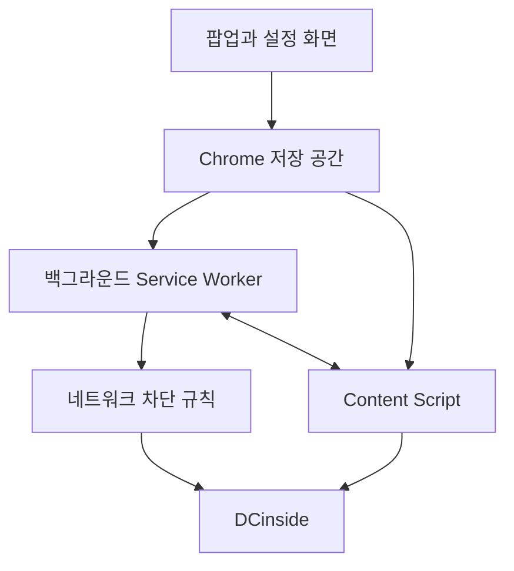

<div align="center">


# 디시갤 차단기

**Less noise. More focus.**

보고 싶지 않은 갤러리와 글, 댓글, 사용자, 이미지 등을 가려  
디시인사이드를 조금 더 편하게 볼 수 있도록 만든 Chrome 확장 프로그램입니다.

[English](README.md)

<p>
  <a href="https://chromewebstore.google.com/detail/fnfmdbldnhadkadklplhcjcojjiaopgg">
    
  </a>
  <a href="https://chromewebstore.google.com/detail/fnfmdbldnhadkadklplhcjcojjiaopgg">
    
  </a>
  <a href="https://chromewebstore.google.com/detail/fnfmdbldnhadkadklplhcjcojjiaopgg">
    
  </a>
</p>

**[Chrome 웹 스토어에서 설치하기](https://chromewebstore.google.com/detail/fnfmdbldnhadkadklplhcjcojjiaopgg)**

</div>

---

## 한눈에 보기

| 구분 | 내용 |
| --- | --- |
| Chrome 웹 스토어 사용자 | **792명** |
| 평점 | **5점 만점에 4.8점** |
| 평점 수 | **18개** |
| 현재 버전 | **7.3.37.2026** |
| 지원 환경 | **Chrome 105 이상 · Manifest V3** |
| 개발 언어 | **JavaScript · HTML · CSS** |
| 배포 | **Chrome 웹 스토어** |

> 사용자 수와 평점은 2026년 8월에 확인한 값입니다. 위의 배지는 이후 최신 값으로 바뀔 수 있습니다.

---

## 왜 만들었나요?

디시인사이드를 이용하다 보면 보고 싶지 않은 글이나 댓글을 여러 곳에서 다시 마주치게 됩니다.

특정 갤러리에 직접 들어가지 않더라도 검색 결과, 최근 방문 목록, 다른 글의 링크, 화면 옆의 목록, 인기 글 목록 등에서 다시 나타날 수 있습니다.

처음에는 제가 보고 싶지 않은 갤러리를 가리기 위해 작은 차단 기능을 만들었습니다.

하지만 직접 써 보니 갤러리 하나를 막는 것만으로는 부족했습니다. 글과 댓글, 특정 사용자, 키워드, 이미지처럼 신경 쓰이는 요소를 따로 가릴 필요가 생겼고, 필요한 기능을 하나씩 더하면서 지금의 확장 프로그램으로 발전했습니다.

이 프로그램이 하려는 일은 단순합니다.

> **무엇을 볼지는 사용자가 직접 정할 수 있어야 합니다.**

---

## 무엇을 할 수 있나요?

README의 기능 이름은 현재 확장 프로그램의 팝업·설정 화면에서 사용하는 이름을 기준으로 적었습니다.

### 갤러리 차단

`갤러리 차단`에 갤러리 주소나 갤러리 아이디를 등록하고, **`차단 방식`**에서 원하는 방법을 고를 수 있습니다.

- `스마트` — 먼저 경고 화면을 보여 줍니다. 그래도 들어가고 싶다면 한 번은 들어갈 수 있습니다.
- `초보` — 경고 화면을 보여 준 뒤 설정한 시간이 지나면 이전 화면으로 돌아갑니다.
- `하드` — 해당 갤러리가 열리기 전에 Chrome의 네트워크 차단 기능으로 막습니다.

현재 보고 있는 갤러리는 **`현재 갤러리 차단`**으로 바로 차단 목록에 넣을 수 있습니다.

### 글과 댓글 정리

필요에 따라 다음 기능을 따로 켜고 끌 수 있습니다.

- `키워드 차단 모드` — 등록한 단어가 들어간 글이나 댓글을 차단합니다.
- `키워드 숨기기 모드` — 해당 내용을 일단 숨기고, 필요할 때 **`계속 보기`**로 다시 열 수 있습니다.
- `사용자 차단` — UID, IP, 닉네임을 기준으로 사용자를 차단합니다.
- `일반 댓글 숨기기`
- `이미지 댓글 숨기기`
- `디시콘 숨기기`
- `비회원 게시물과 댓글 숨기기`
- `게임메카 글/댓글 숨기기`
- `댓글돌이 광고 숨기기`
- `운영자 광고, 설문 글 숨기기`

### 실시간베스트 차단

실시간베스트는 디시인사이드에서 인기 있는 글이나 화제가 되는 글을 모아 보여 주는 곳입니다. 사람들이 인기 글을 읽고 댓글을 달며 이야기를 나누는 공간이기도 합니다.

`실시간베스트 차단`은 사용자가 직접 만든 갤러리 차단 목록과 별도로 켜고 끌 수 있습니다.

### 이미지와 디시콘 차단

- `이미지 차단` — 본문 이미지를 접어 숨기고, 필요할 때 `이미지 보기`로 다시 볼 수 있습니다.
- `개별 이미지 차단 목록` — 따로 차단한 이미지를 확인하고 관리합니다.
- `깡계 차단하기` — 공개 활동 기간과 작성 글·댓글 수를 기준으로 신규·저활동 회원의 글과 댓글을 숨깁니다.
- `숨길 디시콘 선택하기` — `이 디시콘만 차단` 또는 `이 디시콘 그룹 전체 차단`으로 원하는 디시콘만 골라 차단합니다.

### 그 밖의 편의 기능

- `이용자 메모`
  `자동 새로고침`
- `컴팩트 모드`
- `닉네임 옆 회원 ID 표시`
- `글꼴 설정`
- `메인 페이지 영역 숨김`
- `갤러리 페이지 영역 숨김`
- `검색 페이지 영역 숨김`
- `설정 백업/복원`

---

## 사용자 의견을 반영해 고쳐 왔습니다

디시갤 차단기는 제가 혼자 쓰는 프로그램으로 시작했지만, 공개한 뒤 실제 사용자들이 남겨 주는 오류 제보와 의견을 바탕으로 계속 고쳐 왔습니다.

단순히 기능을 더하는 데 그치지 않고 다음 과정을 반복했습니다.

**문제 제보 → 같은 문제 재현 → 원인 확인 → 수정 → 업데이트**

### 실제 의견이 업데이트로 이어진 사례

아래 기능명은 현재 프로젝트의 팝업·설정 화면에 표시되는 이름을 그대로 사용했습니다.

| 사용자가 알려 준 문제나 의견 | 실제로 수정·추가한 기능 | 버전 |
| --- | --- | --- |
| 설정과 차단 목록을 파일로 저장하고 싶다 | `설정 백업/복원` 추가 | 2025년 12월 의견 이후 반영 |
| 긴 글을 읽는 중 자동 새로 고침이 된다 | `자동 새로고침`이 본문을 읽는 중에는 방해하지 않도록 수정 | `7.3.4.2026` |
| 차단한 댓글의 작성자 이름과 안내 문구가 계속 보인다 | `사용자 차단` 적용 시 차단된 댓글과 안내 문구를 화면에서 숨기도록 개선 | `7.3.5.2026` |
| 글 목록의 위아래 간격이 너무 넓다 | `컴팩트 모드` 추가 | `7.3.9.2026` |
| 사용자를 차단할 때 거치는 단계가 많다 | `사용자 차단 방식`에 `우클릭 즉시 차단/해제` 흐름을 적용 | `7.3.11.2026` |
| 댓글 영역 어디에서나 차단 안내창이 뜬다 | `우클릭 즉시 차단/해제`가 작성자 영역에서만 작동하도록 수정 | `7.3.12.2026` |
| 키워드 하나 때문에 글 전체를 못 보는 것은 불편하다 | `키워드 숨기기 모드` 추가 — 필요하면 `계속 보기`로 다시 열 수 있도록 구현 | `7.3.14.2026` |
| 실시간베스트를 쓰고 싶은데 기본으로 막힌다 | `실시간베스트 차단`을 별도 설정으로 분리 | `7.3.21.2026` |
| 여러 갤러리에서 우클릭 차단 시 “작성자 정보를 찾을 수 없습니다”가 뜬다 | `사용자 차단`의 작성자 정보 탐색 경로를 보강하고, 이후 UID/IP 차단 목록 저장 구조까지 개선 | `7.3.22.2026` → `7.3.25.2026` |
| IP나 계정을 바꾸면서 같은 닉네임을 쓰는 사람을 차단하기 어렵다 | `사용자 차단`에서 닉네임 차단을 지원하고, 차단된 댓글의 대댓글도 함께 숨기도록 개선 | `7.3.29.2026` |
| 메모 표시 때문에 글 목록이 넓어지고 IP 표시 간격도 불편하다 | `이용자 메모` 표시 방식을 정리하고 작성자 정보 배치를 조정 | `7.3.29.2026` |
| 이미지 차단을 켰는데도 일부 이미지가 그대로 보인다 | `이미지 차단`을 이미지를 접어 숨기는 방식으로 바꾸고, `깡계 차단하기`를 함께 보강 | `7.3.32.2026` |
| 특정 디시콘 하나나 디시콘 묶음 전체를 골라서 막고 싶다 | `숨길 디시콘 선택하기` 추가 — `이 디시콘만 차단`, `이 디시콘 그룹 전체 차단` 지원 | `7.3.35.2026` |
| 차단한 사람과 다시 대화하려면 차단을 풀기 어렵다 | `우클릭 즉시 차단/해제`와 `차단됨 · 해제`로 같은 화면에서 바로 해제할 수 있도록 개선 | `7.3.36.2026` |
| 댓글을 사용할 때 화면이 떨리고 댓글 작성이나 차단 버튼이 먹통이 된다 | 댓글 갱신 때 화면 전체를 반복 검사하던 처리를 줄여 `사용자 차단`, `이미지 차단` 등 관련 기능의 중복 처리를 완화 | `7.3.37.2026` |

### 오류 하나가 저장 구조 개선으로 이어진 사례

한 사용자가 여러 갤러리에서 마우스 오른쪽 버튼으로 사용자 차단을 시도해도 계속 **“작성자 정보를 찾을 수 없습니다”**라는 안내가 나온다고 알려 주었습니다.

일반 창과 시크릿 창에서도 같은 문제가 나타났고, Chrome과 확장 프로그램을 최신 버전으로 바꿔도 해결되지 않았습니다.

처음에는 작성자 정보를 찾는 부분만 고치면 될 것으로 보았습니다.

하지만 확인 범위를 넓히면서 사용자 차단 목록을 저장하는 방식도 함께 살펴보았습니다.

기존 구조에서는 사용자 UID와 IP 차단 목록이 계속 늘어나면 Chrome 동기화 저장소의 용량과 저장 방식에 따른 제한을 받을 수 있었습니다. 이 때문에 새로운 사용자를 차단하려고 해도 차단 정보가 제대로 저장되지 않거나, 차단 기능이 정상적으로 이어지지 않을 수 있었습니다.

그래서 자주 켜고 끄는 작은 설정은 기존 동기화 저장소에 남기고, 계속 늘어날 수 있는 사용자 UID와 IP 차단 목록은 로컬 기반의 대용량 저장 구조로 분리했습니다.

차단 목록도 하나의 큰 목록으로 저장하지 않고 **256개의 작은 묶음으로 나누어 관리**하도록 바꿨습니다.

```text
기존 방식

사용자 차단 목록
└── 하나의 큰 목록

        ↓

현재 방식

사용자 차단 목록
├── 묶음 000
├── 묶음 001
├── 묶음 002
├── ...
└── 묶음 255
```

사용자를 추가하거나 차단 해제할 때도 전체 목록을 다시 저장하지 않고, 해당 사용자가 들어 있는 묶음만 찾아 고칩니다.

로컬 저장 공간으로 옮기면서 기존 동기화 저장소의 한도에 덜 얽매이게 되었고, 256개의 묶음으로 나누면서 목록 전체를 매번 다시 읽고 쓰는 일도 줄였습니다.

그 결과 차단 사용자가 많아져도 목록을 훨씬 넉넉하고 안정적으로 관리할 수 있게 되었습니다.

화면에 뜨는 오류 하나를 고치는 데서 끝내지 않고, 실제 사용자가 계속 늘어날 때 생길 수 있는 저장 문제까지 함께 손본 사례입니다.

### 화면 떨림 제보가 성능 개선으로 이어진 사례

또 다른 사용자는 댓글을 이용할 때 가끔 화면이 떨리는 것처럼 보이고, 댓글 작성이나 차단 버튼까지 잠시 작동하지 않는다고 알려 주었습니다.

확인 결과 단순히 다른 확장 프로그램과 충돌한 문제가 아니라, 댓글이 바뀔 때 여러 차단 기능이 같은 화면을 반복해서 확인하면서 불필요하게 많은 CPU와 메모리를 사용할 수 있는 구조였습니다.

처리가 한꺼번에 몰리면 화면이 버벅이거나 입력이 잠시 멈추는 현상으로 이어질 수 있었습니다.

이후 화면 전체를 계속 다시 확인하는 일을 줄이고, **새로 생기거나 바뀐 부분만 다시 확인**하도록 처리 방식을 고쳤습니다.

이미지 차단 버튼이 계속 다시 만들어지던 문제와 댓글 입력창까지 영향을 받을 수 있던 부분도 함께 수정했습니다.

이 과정을 거치면서 **내 컴퓨터에서 한 번 작동하는 기능**과 **여러 사람이 계속 안정적으로 쓸 수 있는 프로그램**은 다른 문제라는 점을 배웠습니다.

---

## 어떻게 작동하나요?

Chrome 확장 프로그램은 하나의 파일이 모든 일을 처리하는 방식이 아닙니다.

팝업, 설정 화면, 디시인사이드 페이지에서 작동하는 코드, 브라우저 뒤에서 작동하는 코드는 서로 다른 실행 영역에서 돌아갑니다.



쉽게 설명하면 다음과 같습니다.

- **팝업과 설정 화면** — 무엇을 차단할지, 어떤 기능을 켤지 정합니다.
- **Content Script** — 디시인사이드 화면을 살펴보고 필요 없는 글이나 요소를 숨깁니다.
- **Service Worker** — **`하드`** 차단에 필요한 처리, 메시지 처리, 마우스 오른쪽 버튼 메뉴처럼 브라우저 쪽에서 처리해야 하는 일을 맡습니다.
- **Chrome Storage** — 차단 목록과 각종 설정을 저장합니다.
- **Declarative Net Request** — **`하드`** 방식을 선택했을 때 갤러리가 열리기 전에 접근을 막습니다.

JavaScript, HTML, CSS만 사용하며 별도의 프레임워크, 자체 서버, 패키지 설치, 빌드 과정은 필요하지 않습니다.

---

## 만들면서 해결한 기술 문제

### 페이지를 연 뒤 새로 나타나는 내용 처리

디시인사이드는 처음 화면을 연 뒤에도 댓글이나 글, 이미지 같은 내용이 계속 추가되거나 바뀔 수 있습니다.

처음 한 번만 확인하면 이런 내용을 놓치게 됩니다.

반대로 화면이 바뀔 때마다 페이지 전체를 다시 검사하면 CPU와 메모리 사용량이 늘고, 심한 경우 화면이 버벅이거나 입력이 잠시 멈출 수 있습니다.

그래서 새로 생기거나 바뀐 부분을 찾아 필요한 곳만 다시 확인하도록 만들었습니다.

안에서는 `MutationObserver`, `requestAnimationFrame`, 짧은 대기 시간 조절, `document_start` 같은 브라우저 기능을 함께 사용합니다.

### 같은 내용이 여러 곳에서 다시 나타나는 문제

갤러리 주소 하나만 막아도 문제가 끝나지는 않습니다.

차단한 갤러리는 검색 결과, 최근 방문 목록, 화면 옆의 링크, 다른 글 안의 링크, 실시간 베스트, 나중에 새로 만들어진 화면 요소 등에서 다시 나타날 수 있습니다.

그래서 상황에 따라 여러 방법을 함께 씁니다.

```text
네트워크에서 접근 차단
        ↓
페이지 이동 확인
        ↓
링크와 화면 내용 숨기기
        ↓
나중에 새로 생긴 내용도 다시 확인
```

이렇게 나누어 처리하기 때문에 사용자는 경고만 받을지, 잠시 뒤 돌아갈지, 아예 열리지 않게 할지도 고를 수 있습니다.

### 사용자 차단 목록이 늘어나면서 생긴 저장 한도 문제

처음에는 사용자 UID와 IP 차단 목록을 Chrome 동기화 저장소 중심으로 관리했습니다.

차단한 사용자가 많지 않을 때는 문제가 없었지만, 목록이 계속 늘어나면 저장소의 용량과 저장 방식에 따른 제한을 받게 됩니다.

이 때문에 새로운 사용자를 차단하려고 해도 차단 정보가 제대로 저장되지 않거나, 차단 기능이 정상적으로 이어지지 않을 수 있었습니다.

그래서 작은 설정과 큰 차단 목록의 저장 방식을 나눴습니다.

- 자주 켜고 끄는 작은 설정은 `chrome.storage.sync`
- 계속 늘어날 수 있는 사용자 차단 자료는 `chrome.storage.local`
- UID, IP, 닉네임은 저장하기 전에 일정한 형식으로 정리
- 차단 정보는 256개의 묶음으로 나누어 저장
- 사용자를 추가하거나 지울 때 필요한 묶음만 수정

이 구조로 바꾸면서 차단 목록 한도를 훨씬 넉넉하게 가져갈 수 있었고, 목록 전체를 매번 다시 저장하는 일도 줄였습니다.

### 같은 이미지를 다시 알아보는 방법

이미지 차단은 주소만 기억하지 않습니다.

이미지의 특징값을 SHA-256 방식으로 만들어 함께 사용하기 때문에, 같은 이미지의 주소가 달라져도 다시 알아볼 수 있도록 만들었습니다.

### 확장 프로그램의 실행 영역 간 메시지 통신

Chrome 확장 프로그램의 팝업, 설정 화면, Content Script, Service Worker는 모두 같은 곳에서 실행되지 않습니다.

각 기능은 서로 다른 실행 영역에서 작동하기 때문에, 한쪽의 함수를 다른 쪽에서 바로 실행할 수 없습니다.

그래서 Chrome의 메시지 전달 기능을 사용해 필요한 정보와 작업 요청을 주고받도록 구성했습니다.

```text
팝업 / 설정 화면
       ↕
Chrome 메시지 통신
       ↕
Service Worker
       ↕
Chrome 메시지 통신
       ↕
Content Script
```

예를 들어 디시인사이드 화면에서 작동하는 Content Script가 브라우저 뒤에서 처리해야 하는 작업이 필요하면 Service Worker에 메시지를 보내 요청합니다.

글 미리 보기나 계정 정보 확인처럼 외부 요청이 필요한 기능도 Content Script마다 따로 처리하지 않고, 필요한 요청을 Service Worker로 전달해 처리합니다.

이때 요청할 수 있는 디시인사이드 주소, 통신 방식, 일부 요청 정보도 미리 제한해 정해 둔 범위 안에서만 처리되도록 구성했습니다.

---

## 코드 구조도 다시 정리하고 있습니다

처음에는 기능 수가 적어 대부분의 파일을 한곳에 두어도 큰 문제가 없었습니다.

하지만 기능이 계속 늘어나면서 한 파일이 너무 많은 일을 맡거나, 서로 관계없는 기능이 같은 위치에 섞이기 시작했습니다.

현재는 역할에 따라 다음과 같이 나누는 방향으로 리팩터링하고 있습니다.

```text
src/
├── background/   브라우저 뒤에서 처리하는 기능
├── content/      디시인사이드 화면에서 작동하는 기능
│   ├── gallery/
│   ├── user/
│   ├── keyword/
│   ├── image/
│   ├── dccon/
│   ├── cleaner/
│   ├── appearance/
│   └── tools/
├── shared/       여러 기능에서 함께 쓰는 코드
└── ui/           팝업과 설정 화면
    ├── popup/
    ├── options/
    └── shared/
```

단순히 폴더를 보기 좋게 만드는 것이 목적은 아닙니다.

새 기능 하나를 고쳤을 때 관계없는 다른 기능까지 함께 고쳐야 하는 일을 줄이고, 문제가 생겼을 때 어느 부분을 확인해야 하는지 더 쉽게 찾을 수 있도록 만드는 것이 목표입니다.

---

## 개인정보 보호

디시갤 차단기를 사용하기 위해 별도의 계정을 만들 필요가 없습니다.

개발자가 따로 운영하는 사용자 정보 데이터베이스도 두고 있지 않으며, 이용자를 추적하기 위한 분석 도구나 추적용 픽셀도 넣지 않았습니다.

대부분의 설정과 개인 차단 자료는 Chrome의 확장 프로그램 저장 공간 안에 보관됩니다.

작은 설정은 Chrome 동기화 저장 공간을 사용할 수 있고, 사용자 차단 목록, 메모, 이미지 기록, 임시 자료처럼 큰 정보는 해당 브라우저의 로컬 저장 공간에 보관할 수 있습니다.

일부 기능은 필요할 때 허용된 디시인사이드 주소에서 정보를 직접 가져옵니다. 사용자의 차단 목록이나 방문 기록을 모으기 위한 별도의 개발자 서버는 운영하지 않습니다.

---

## 사용한 기술

| 구분 | 사용 기술 |
| --- | --- |
| 프로그래밍 언어 | JavaScript |
| 화면 구성 | HTML, CSS |
| 확장 프로그램 방식 | Chrome Manifest V3 |
| 최소 Chrome 버전 | 105 |
| 설정과 자료 저장 | Chrome Storage API |
| 네트워크 단계 차단 | Declarative Net Request |
| 브라우저 뒤 작업 | Service Worker |
| 화면 변화 확인 | MutationObserver |
| 브라우저 기능 연결 | Context Menus, Active Tab |
| 배포 | Chrome 웹 스토어 |

---

## 설치 방법

### Chrome 웹 스토어

**[Chrome 웹 스토어에서 설치하기](https://chromewebstore.google.com/detail/fnfmdbldnhadkadklplhcjcojjiaopgg)**

1. **Chrome에 추가**를 누릅니다.
2. 설치가 끝나면 Chrome 도구 모음에서 디시갤 차단기를 엽니다.
3. 보고 싶지 않은 갤러리나 내용을 등록합니다.
4. 원하는 차단 방법을 고릅니다.

처음 사용한다면 `스마트` 방식을 권합니다.

완전히 접근을 막는 대신 먼저 경고해 주기 때문에, 필요할 때는 사용자가 직접 들어갈 수 있습니다.

---

## 직접 실행하기

저장소를 내려받거나 복제한 뒤 다음 주소를 엽니다.

```text
chrome://extensions
```

그다음:

1. **개발자 모드**를 켭니다.
2. **압축해제된 확장 프로그램을 로드합니다**를 누릅니다.
3. `manifest.json`이 있는 프로젝트 폴더를 선택합니다.

따로 설치해야 하는 개발 도구나 빌드 과정은 없습니다.

---

## 이 프로젝트에서 배운 점

처음에는 제가 필요한 기능이 제대로 작동하는지가 가장 중요했습니다.

하지만 실제 사용자가 생기고 기능이 늘어나면서 확인해야 할 것도 많아졌습니다.

새 기능 하나를 만들거나 기존 기능을 고칠 때도 다음을 함께 살펴보게 되었습니다.

- 한 기능을 고쳤을 때 다른 기능까지 영향을 받지는 않는가
- 댓글이나 글이 갱신될 때 불필요한 반복 처리가 발생해 CPU와 메모리 사용량이 늘거나, 화면이 버벅이고 입력이 멈추지는 않는가
- 사용자 차단 목록이 계속 늘어나도 저장 공간의 제한 때문에 차단 기능이 멈추지는 않는가
- 업데이트한 뒤에도 기존 사용자의 설정과 차단 목록이 그대로 유지되는가
- 사용자가 제보한 오류를 같은 조건에서 재현하고 원인을 확인할 수 있는가
- 화면에 나타난 오류만 고치는 데 그치지 않고, 그 뒤에 더 큰 구조 문제가 있는지도 확인했는가
- 기능이 계속 늘어나도 다시 읽고 수정하기 쉬운 코드 구조를 유지하고 있는가

처음에는

> **“이 기능이 작동하는가?”**

를 먼저 생각했다면, 지금은

> **“여러 사용자가 계속 안정적으로 사용할 수 있고, 앞으로도 안전하게 고쳐 나갈 수 있는가?”**

까지 함께 생각하게 되었습니다.

---

<div align="center">

**보고 싶은 것에 더 집중하세요.**

[English](README.md) · [Chrome 웹 스토어](https://chromewebstore.google.com/detail/fnfmdbldnhadkadklplhcjcojjiaopgg)

</div>
