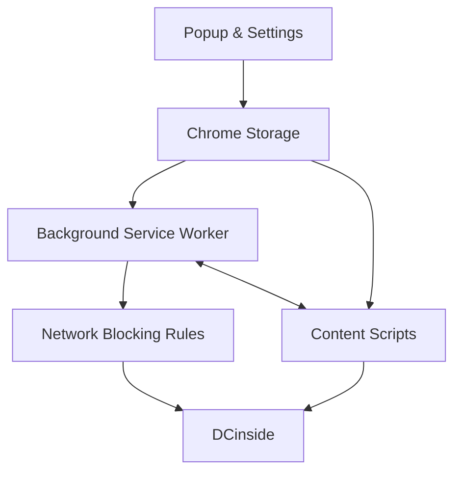

<div align="center">


# DCinside Gallery Blocker

**Less noise. More focus.**

A Chrome extension that helps you control what you see on DCinside.

Block unwanted galleries, posts, comments, users, keywords, images, and other distractions — without sending your personal block lists to a developer-run server.

[한국어](README.ko.md)

<p>
  <a href="https://chromewebstore.google.com/detail/fnfmdbldnhadkadklplhcjcojjiaopgg">
    
  </a>
  <a href="https://chromewebstore.google.com/detail/fnfmdbldnhadkadklplhcjcojjiaopgg">
    
  </a>
  <a href="https://chromewebstore.google.com/detail/fnfmdbldnhadkadklplhcjcojjiaopgg">
    
  </a>
</p>

**[Install from the Chrome Web Store](https://chromewebstore.google.com/detail/fnfmdbldnhadkadklplhcjcojjiaopgg)**

</div>

---

## Project Snapshot

| | |
| --- | --- |
| Chrome Web Store users | **792** |
| Store rating | **4.8 / 5** |
| Ratings | **18** |
| Current release | **7.3.37.2026** |
| Platform | **Chrome 105+ · Manifest V3** |
| Stack | **JavaScript · HTML · CSS** |
| Distribution | **Chrome Web Store** |

> Store numbers above are a snapshot from August 2026. The badges at the top may show newer values.

---

## Why I Built It

DCinside is a fast-moving community. Even if you avoid a particular gallery, its posts, users, or links can still show up in search results, sidebars, recently visited lists, and the site's popular posts page.

I originally built this extension for a simple reason: I wanted to decide for myself what I saw while browsing.

A basic gallery blacklist worked at first, but it did not solve the whole problem. Blocking one page did not stop unwanted links, comments, users, images, or newly loaded content from appearing elsewhere.

What started as a small personal blocker gradually grew into a full Chrome extension for filtering and customizing DCinside.

> **Give users more control over what they see.**

---

## What You Can Do

The names below follow the current extension UI. Korean labels are included in backticks so the README can be matched directly to the product.

### Gallery blocking

Add a gallery by ID or URL with **Gallery Blocking (`갤러리 차단`)**, then choose a **Blocking Mode (`차단 방식`)**:

- **Smart (`스마트`)** — shows a warning first and still lets you enter when you intentionally want to.
- **Beginner (`초보`)** — shows a warning, then returns you to the previous page after the configured delay.
- **Hard (`하드`)** — blocks the gallery before it loads by using Chrome's network-blocking API.

You can also add the gallery you are currently viewing with **Block Current Gallery (`현재 갤러리 차단`)**.

### Post and comment controls

You can turn the following filters on or off separately:

- **Keyword Block Mode (`키워드 차단 모드`)**
- **Keyword Hide Mode (`키워드 숨기기 모드`)** — hidden items can be reopened with **Continue Viewing (`계속 보기`)**
- **User Blocking (`사용자 차단`)** — supports UID, IP, and nickname-based entries
- **Hide Regular Comments (`일반 댓글 숨기기`)**
- **Hide Image Comments (`이미지 댓글 숨기기`)**
- **Hide DCCons (`디시콘 숨기기`)**
- **Hide Non-member Posts and Comments (`비회원 게시물과 댓글 숨기기`)**
- **Hide GameMeca Posts/Comments (`게임메카 글/댓글 숨기기`)**
- **Hide Dory Ads (`댓글돌이 광고 숨기기`)**
- **Hide Operator Ads and Surveys (`운영자 광고, 설문 글 숨기기`)**

### DCinside's popular posts page

DCinside has a dedicated page that collects popular and trending posts from across the site. Users can browse those posts, read the discussions, and join the comments.

**Block Popular Posts Page (`실시간베스트 차단`)** can be turned on or off separately from your own gallery block list.

### Image and DCCon controls

- **Image Blocking (`이미지 차단`)** — collapses post images and lets the user reveal them with **View Image (`이미지 보기`)**
- **Individual Image Block List (`개별 이미지 차단 목록`)**
- **Block New/Low-Activity Accounts (`깡계 차단하기`)** — uses public activity age and post/comment counts to filter new or low-activity member accounts
- **Choose DCCons to Hide (`숨길 디시콘 선택하기`)** — supports **Block This DCCon Only (`이 디시콘만 차단`)** and **Block This Entire DCCon Group (`이 디시콘 그룹 전체 차단`)**

### Other browsing tools

- **User Notes (`이용자 메모`)**
- **Auto Refresh (`자동 새로고침`)**
- **Compact Mode (`컴팩트 모드`)**
- **Show Member ID Next to Nickname (`닉네임 옆 회원 ID 표시`)**
- **Font Settings (`글꼴 설정`)**
- **Hide Main Page Sections (`메인 페이지 영역 숨김`)**
- **Hide Gallery Page Sections (`갤러리 페이지 영역 숨김`)**
- **Hide Search Page Sections (`검색 페이지 영역 숨김`)**
- **Settings Backup/Restore (`설정 백업/복원`)**

---

## Built with Real User Feedback

I built the first version for myself. Once other people started using it, the project became less about adding features and more about maintaining software people actually relied on.

Chrome Web Store reviews have directly shaped bug fixes, performance improvements, storage changes, UI changes, and new features.

The development loop became:

**Report → Reproduce → Diagnose → Fix → Release**

### Selected feedback that became releases

To keep the portfolio documentation traceable to the product, this table uses the current UI feature names and includes the exact Korean labels.

| User report or request | Product feature changed | Release |
| --- | --- | --- |
| Wanted settings and block lists saved to a file | Added **Settings Backup/Restore (`설정 백업/복원`)** | Added after the Dec. 2025 request |
| Auto-refresh interrupted long posts | Updated **Auto Refresh (`자동 새로고침`)** so it does not unexpectedly refresh while reading a post | `7.3.4.2026` |
| Blocked comments still left the author name and a blocked-comment notice visible | Updated **User Blocking (`사용자 차단`)** so blocked comments and their notice can be fully hidden | `7.3.5.2026` |
| Post rows felt too widely spaced | Added **Compact Mode (`컴팩트 모드`)** | `7.3.9.2026` |
| Right-click blocking required too many steps | Added the **Instant Right-click Block/Unblock (`우클릭 즉시 차단/해제`)** flow under **User Blocking Mode (`사용자 차단 방식`)** | `7.3.11.2026` |
| The right-click blocking prompt appeared across the whole comment area | Restricted **Instant Right-click Block/Unblock (`우클릭 즉시 차단/해제`)** to the intended author area | `7.3.12.2026` |
| Keyword blocking was too strict when users only wanted content hidden temporarily | Added **Keyword Hide Mode (`키워드 숨기기 모드`)**, with **Continue Viewing (`계속 보기`)** for reopening hidden content | `7.3.14.2026` |
| DCinside's popular posts page was blocked by default with no separate control | Added a separate **Block Popular Posts Page (`실시간베스트 차단`)** setting | `7.3.21.2026` |
| Right-click blocking returned “Could not find author information” across multiple galleries | Strengthened author lookup for **User Blocking (`사용자 차단`)**, then redesigned UID/IP block-list storage after broader testing | `7.3.22.2026` → `7.3.25.2026` |
| Users could change IPs or accounts while keeping the same nickname | Extended **User Blocking (`사용자 차단`)** with nickname matching and hiding of replies attached to blocked comments | `7.3.29.2026` |
| Memo controls made post lists too tall and author/IP information felt too spread out | Refined **User Notes (`이용자 메모`)** and tightened the author-information layout | `7.3.29.2026` |
| Image blocking sometimes appeared to do nothing | Changed **Image Blocking (`이미지 차단`)** to collapse blocked images and strengthened **Block New/Low-Activity Accounts (`깡계 차단하기`)** | `7.3.32.2026` |
| Users wanted to block one DCCon or an entire DCCon pack | Added **Choose DCCons to Hide (`숨길 디시콘 선택하기`)** with **Block This DCCon Only (`이 디시콘만 차단`)** and **Block This Entire DCCon Group (`이 디시콘 그룹 전체 차단`)** | `7.3.35.2026` |
| Unblocking a user required going back into settings | Added in-place unblocking through **Instant Right-click Block/Unblock (`우클릭 즉시 차단/해제`)** and **Blocked · Unblock (`차단됨 · 해제`)** | `7.3.36.2026` |
| Comment pages sometimes jittered and controls stopped responding | Reduced repeated full-page processing during comment updates, cutting duplicate work around **User Blocking (`사용자 차단`)**, **Image Blocking (`이미지 차단`)**, and related filters | `7.3.37.2026` |

### One bug report led to a storage redesign

One user reported that right-click blocking no longer worked in any of the galleries they tested. The extension kept returning “Could not find author information,” even after testing in regular and Incognito windows with an up-to-date browser and extension.

The first fix focused on finding author information more reliably.

Further testing showed that author lookup was only part of the problem. As block lists grew, the previous storage design could also run into Chrome Sync limits.

I kept small, frequently changed preferences in Chrome Sync, moved larger UID/IP block data into local extension storage, and split the block list across **256 buckets**.

```text
Before

One growing block list
        ↓
Larger writes and storage limits become more noticeable


After

User block store
├── bucket 000
├── bucket 001
├── bucket 002
├── ...
└── bucket 255
```

Adding or removing a user now updates only the relevant bucket instead of rewriting one large list.

Moving the large block list to local storage gave it much more room to grow, while the bucketed design meant each change only had to rewrite a small part of the data.

A bug that first looked like a UI issue ended up prompting a redesign of the block-list storage layer.

### One performance report changed how page updates were handled

Another user reported occasional screen jitter, along with moments when comment input and blocking controls stopped responding.

The issue was inside the extension rather than a simple conflict with another add-on. Several filters could respond to the same comment update and repeatedly process too much of the page, increasing CPU and memory usage.

I changed the update path so filters process newly added or changed elements instead of repeatedly scanning the whole page.

The same release also addressed repeatedly recreated image-block controls and cases where comment input could be affected.

That bug changed how I think about maintenance:

> Once people depend on software, performance, compatibility, recovery, and everyday usability become part of the engineering problem.

---

## How It Works

A Chrome extension is split across several execution contexts, each with a different job.



In this project:

- **Popup and settings pages** handle user preferences.
- **Content scripts** watch DCinside pages and hide or modify unwanted content.
- **The service worker** handles browser-level jobs such as network rules, messaging, and right-click actions.
- **Chrome Storage** keeps settings and personal block data.
- **Declarative Net Request** handles strict network-level gallery blocking.

The extension is built with plain JavaScript, HTML, and CSS. There is no framework, package installation, custom backend, or build step.

---

## Engineering Challenges

### Handling pages that change after they load

DCinside pages can add or modify comments, rows, images, and other elements after the initial page load.

Rescanning the entire page after every update wastes CPU time and can cause noticeable lag.

The extension combines:

- `MutationObserver`
- targeted DOM checks
- `requestAnimationFrame`
- short debounce windows
- scripts that can start at `document_start`

This lets the extension react to new content while keeping full-page rescans to a minimum.

### Blocking the same content in different places

Blocking the gallery URL alone is not enough.

The same gallery can still show up through direct links, search results, recently visited lists, sidebars, DCinside's popular posts page, and links added after the page loads.

The extension therefore handles blocking at several levels:

```text
Network request
      ↓
Page navigation
      ↓
Links and page content
      ↓
Content added later
```

Handling these layers separately also lets users choose how strict they want blocking to be.

### Making large user block lists reliable

The original storage design was fine for small block lists, but larger UID/IP lists could hit Chrome Sync limits and require increasingly large rewrites.

The current approach separates small preferences from larger block data:

- smaller settings can stay in `chrome.storage.sync`
- larger user block data can use `chrome.storage.local`
- UID/IP/nickname values are normalized before storage
- block keys are hashed with FNV-1a
- records are distributed across 256 buckets
- only the affected bucket is updated when a user is added or removed

The result is a block list with much more practical headroom, without rewriting one growing array every time a user is added or removed.

### Recognizing blocked images more reliably

Image blocking uses SHA-256 fingerprints so the extension can recognize the same file even when the URL changes.

That keeps image blocking from depending on a particular image URL.

### Cross-Context Messaging

The popup, options page, content scripts, and background service worker all run in separate extension contexts.

Because they do not share one JavaScript runtime, they communicate through Chrome's messaging APIs.

```text
Popup / Options
       ↕
Chrome Messaging
       ↕
Service Worker
       ↕
Chrome Messaging
       ↕
Content Scripts
```

Post previews and account lookups are routed through the service worker instead of letting each content script make its own request.

The request broker restricts traffic to approved DCinside hosts, supported protocols, allowed HTTP methods, and a limited set of headers.

---

## Refactoring the Codebase

The project grew one feature at a time. That was manageable early on, but the original flat file structure became harder to work with as the codebase grew.

The current refactor groups code by responsibility:

```text
src/
├── background/
├── content/
│   ├── gallery/
│   ├── user/
│   ├── keyword/
│   ├── image/
│   ├── dccon/
│   ├── cleaner/
│   ├── appearance/
│   └── tools/
├── shared/
└── ui/
    ├── popup/
    ├── options/
    └── shared/
```

This is more than a folder cleanup.

The goal is to make features easier to change in isolation and make bugs easier to trace to the part of the extension that owns them.

---

## Privacy

DCinside Gallery Blocker does not require a separate account or a developer-operated user database.

The project does not include analytics SDKs or tracking pixels.

Most settings and personal block data stay inside Chrome's extension storage. Small preferences may use Chrome Sync, while larger data such as user blocks, notes, image records, and caches can stay in local extension storage.

Some features request information directly from approved DCinside services when needed. The developer does not run a separate backend for collecting user block lists or browsing history.

---

## Tech Stack

| Area | Technology |
| --- | --- |
| Language | JavaScript |
| Interface | HTML, CSS |
| Platform | Chrome Extension |
| Extension model | Manifest V3 |
| Minimum Chrome version | 105 |
| Local data | Chrome Storage API |
| Network blocking | Declarative Net Request |
| Background tasks | Service Worker |
| Dynamic page handling | MutationObserver |
| Browser integration | Context Menus, Active Tab |
| Distribution | Chrome Web Store |

---

## Install

### Chrome Web Store

**[Install DCinside Gallery Blocker](https://chromewebstore.google.com/detail/fnfmdbldnhadkadklplhcjcojjiaopgg)**

1. Click **Add to Chrome**.
2. Open the extension from the Chrome toolbar.
3. Add the galleries or content you want to block.
4. Choose the blocking mode that fits how you browse.

**Smart (`스마트`)** is a good starting point if you want fewer distractions without completely locking yourself out of a gallery.

---

## Run It Locally

Clone the repository:

```bash
git clone https://github.com/diligencefrozen/DCinside-Gallery-Blocker.git
```

Then:

1. Open `chrome://extensions`.
2. Turn on **Developer mode**.
3. Click **Load unpacked**.
4. Select the project folder containing `manifest.json`.

No dependency installation or build step is required.

---

## What This Project Taught Me

At first, I mostly asked whether a feature worked.

Once real users started relying on it, I had to ask different questions:

- Does a change to one feature break another?
- Do page updates trigger unnecessary repeated work that increases CPU or memory usage and causes lag or temporary UI freezes?
- Can a growing user block list exceed the limits of the current storage design?
- Do existing settings and block lists survive an update?
- Can I reproduce a user-reported bug under the same conditions and identify its cause?
- Is the visible bug only a symptom of a deeper architectural problem?
- Can the codebase keep growing without becoming harder to understand and change?

The biggest shift was moving from:

> **“Does this feature work?”**

to:

> **“Can people rely on it, and can I keep improving it safely?”**

---

<div align="center">

**Clean up DCinside. Keep what matters.**

[Chrome Web Store](https://chromewebstore.google.com/detail/fnfmdbldnhadkadklplhcjcojjiaopgg) · [한국어](README.ko.md)

</div>
