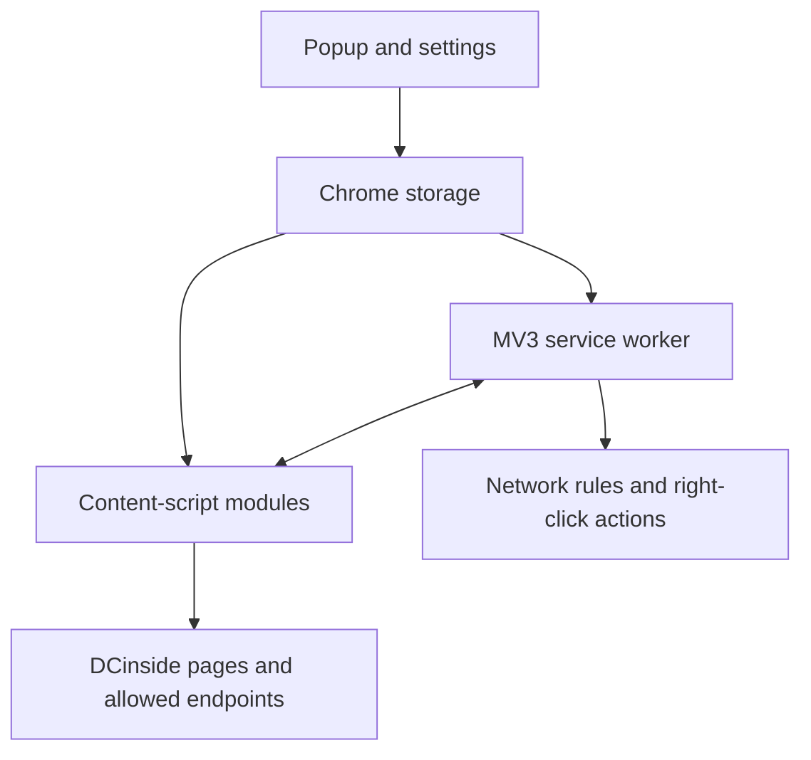

  

  <h1>DCinside Gallery Blocker</h1>

  
<strong>Less noise. More focus.</strong>

  

    A Chrome extension that helps users block unwanted galleries, posts, comments, 
    users, keywords, and images on DCinside.
  

  

    
    
    
  

  

    <a href="https://chromewebstore.google.com/detail/fnfmdbldnhadkadklplhcjcojjiaopgg"><strong>Install from the Chrome Web Store</strong></a>
  

---

## Overview

DCinside is a large online forum in South Korea where new posts, comments, and page elements can appear after the initial load. A basic URL blacklist is not enough: blocked content can still show up in sidebars, search results, recent-visit lists, and live comment sections.

DCinside Gallery Blocker handles that problem at the network, navigation, and DOM layers. It can stop a gallery before it loads, hide links that lead to it, and keep filtering the page as new content appears.

The extension is built with plain JavaScript, HTML, and CSS. There is no framework, build step, dependency install, or custom backend.

| At a glance | Details |
| --- | --- |
| Release | `7.3.33.2026` |
| Platform | Chrome 105+, Manifest V3 |
| Architecture | Service worker, 31 content-script modules, popup, and settings page |
| Core APIs | Chrome Storage, Declarative Net Request, Context Menus, Active Tab |
| Distribution | Chrome Web Store |

## Key Features

- Block galleries by ID or URL, including a separate switch for Real-Time Best.
- Choose between a warning screen, timed redirect, or hard network-level blocking.
- Filter posts and comments by keyword, UID, IP prefix, or nickname.
- Hide comments, DCCons, images, anonymous posts, notices, surveys, and selected automated content.
- Add private user notes, preview posts from the list, and refresh list rows automatically.
- Customize page sections, list density, theme, font, and text size.
- Export and restore settings, block lists, notes, and image records as JSON.

## Architecture

Settings are saved through the popup or full settings page. Storage events update the service worker and active content scripts, so most changes take effect without a refresh. The service worker handles network rules and right-click actions, while content scripts handle warnings, filtering, previews, and page customization.

## Engineering Highlights

### Layered blocking

One gallery list powers three modes. Smart mode shows a warning and allows one-time access. Redirect mode sends the user back after a countdown. Hard mode converts gallery IDs into dynamic Declarative Net Request rules and stops the page before it loads. Link filtering runs separately, keeping sidebars and recent-visit lists clean in every mode.

### Storage built to scale

Small preferences use `chrome.storage.sync`; larger personal data stays in `chrome.storage.local`. The user block store normalizes UID, IP, and nickname values, hashes them with FNV-1a, and spreads the records across 256 buckets instead of rewriting one large array. Individual image blocks use SHA-256 fingerprints so the same file can remain blocked under a different URL.

### Fast updates on a dynamic site

Filters start at `document_start` to reduce unwanted content flashing on screen. `MutationObserver`, targeted attribute checks, animation-frame scheduling, and short debounce windows handle new rows, comments, images, and previews without repeatedly rescanning the entire page.

Requests used for previews and account checks pass through an allowlisted service-worker broker limited to approved DCinside and Gallog hosts, `GET` and `POST`, and a small set of headers. If an account check cannot produce a reliable result, the extension leaves the content visible instead of guessing.

## Privacy

The codebase has no analytics SDK, tracking pixel, developer-run API, or account system. Small preferences may sync through the user's Chrome profile, while user blocks, notes, image records, and caches stay in local extension storage. Some features request data from approved DCinside or Gallog endpoints, and the interface uses Google Fonts.

## Run Locally

1. Clone or download the repository.
2. Open `chrome://extensions` in Chrome.
3. Enable **Developer mode**.
4. Click **Load unpacked**.
5. Select the directory containing `manifest.json`.

No build step or dependency install is required.

---

  <strong>Clean up DCinside. Keep what matters.</strong>

