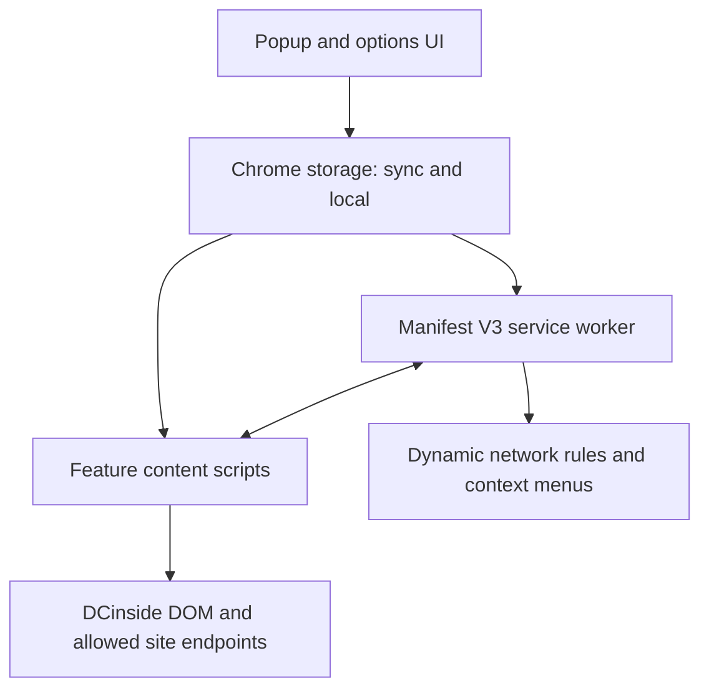

  

  <h1>DCinside Gallery Blocker</h1>

  
<strong>Less noise. More focus.</strong>

  

    A production Chrome extension for blocking unwanted destinations, filtering dynamic content, 
    and turning DCinside into a user-controlled browsing environment.
  

  

    
    
    
  

  

    <a href="https://chromewebstore.google.com/detail/fnfmdbldnhadkadklplhcjcojjiaopgg"><strong>Install from the Chrome Web Store</strong></a>
    ·
    <a href="#architecture">Architecture</a>
    ·
    <a href="#run-locally">Run locally</a>
  

---

## Overview

DCinside Gallery Blocker is a published Manifest V3 extension that applies user-defined browsing rules across DCinside. It can stop navigation to blocked galleries, hide links before they are clicked, and continuously filter posts, comments, users, keywords, images, and page regions as the site updates.

The project is built with vanilla JavaScript, HTML, and CSS. It has no framework, package manager, build step, or developer-operated backend.

| Project snapshot | Details |
| --- | --- |
| Release | `7.3.33.2026` |
| Platform | Chrome 105+, Manifest V3 |
| Architecture | Service worker, 31 feature content scripts, popup, and options page |
| Core APIs | Chrome Storage, Declarative Net Request, Context Menus, Active Tab |
| Application stack | Vanilla JavaScript, HTML, CSS, Web Crypto, DOM APIs |
| Distribution | Chrome Web Store |

## The Problem

A simple URL blacklist is not enough for a dynamic community site.

DCinside exposes several gallery route formats, inserts posts and comments after the initial page load, and surfaces the same unwanted content through sidebars, recent-visit lists, search results, and previews. A useful blocker therefore has to enforce the same policy at three different points:

1. Before a blocked page loads.
2. While the user navigates the current page.
3. After new content is inserted into the DOM.

This project treats blocking as a browser policy system rather than a one-time CSS cleanup.

## What the Extension Does

| Area | Capabilities |
| --- | --- |
| Gallery access | Block by gallery ID or URL, block Real-Time Best independently, and quick-block the current gallery |
| Blocking behavior | Smart warning with one-time access, timed redirect, or hard network-level blocking |
| Text filtering | Block or temporarily collapse matched keywords in list titles, post titles, bodies, and comments |
| User controls | Block by UID, IP prefix, or nickname; add private user memos; show compact identity hints |
| Content cleanup | Hide ordinary comments, image comments, DCCons, anonymous posts, notices, surveys, and selected automated content |
| Image controls | Hide all post images, block individual images, reveal an item temporarily, and manage saved image blocks |
| Account signals | Optionally hide posts or comments from new or low-activity member accounts using configurable thresholds |
| Page customization | Hide selected page regions, use compact lists, switch theme, choose a Google Font, and scale typography |
| Browsing tools | Preview posts without leaving the list and refresh list rows automatically at a configurable interval |
| Portability | Export and restore versioned settings, block lists, user memos, and image-block records as JSON |

## Architecture

The popup and options page write user policy to Chrome storage. Storage change events then update both the service worker and the active content scripts. The service worker owns network rules, guarded same-site requests, and context-menu actions; content scripts own navigation warnings, DOM filtering, page customization, and live UI updates.

## Engineering Highlights

### 1. Three blocking modes, one policy

The same gallery block list drives three different enforcement strategies:

- **Smart mode** renders an access warning and supports a session-scoped “view once” exception.
- **Redirect mode** shows a countdown and returns the user to the DCinside home page.
- **Hard mode** converts blocked gallery IDs into dynamic Declarative Net Request rules and stops the main-frame request before the page loads.

Blocked gallery links are filtered separately from page access. This keeps sidebars, cards, and recent-visit lists clean even when the user temporarily opens one blocked destination.

### 2. Storage designed for both convenience and scale

Small preferences live in `chrome.storage.sync`, while larger or more personal collections—user blocks, memos, image fingerprints, and caches—live in `chrome.storage.local`.

The user block store does not rewrite one increasingly large array on every update. It normalizes UID, IP, and nickname tokens, hashes each key with FNV-1a, and distributes records across 256 local-storage buckets. A compatibility migration imports data from the legacy array format without discarding existing rules.

### 3. Resilience on a changing DOM

Many filters start at `document_start` so unwanted elements can be hidden before the page becomes visible. `MutationObserver`, targeted attribute observation, animation-frame scheduling, and short debounce windows then handle dynamically loaded rows, comments, images, and previews without rescanning the page for every individual mutation.

Storage listeners reapply changed rules to open tabs, so most settings take effect without a manual refresh.

### 4. Guarded requests for site-dependent features

Features such as post previews and account-activity checks need DCinside data. The service worker exposes a narrow HTML request broker that:

- allows only known DCinside and Gallog hosts;
- accepts only `GET` and `POST`;
- forwards only an approved set of headers; and
- returns structured success and error results to content scripts.

Account checks are concurrency-limited, deduplicated while in flight, and cached locally. When the required signal is unavailable, the filter fails open and leaves the content visible.

### 5. Efficient image matching

Individual image blocks begin with a fast SHA-256 fingerprint of the source URL. File bytes are inspected only when saved block records make deeper matching useful. The extension then stores aliases between quick URL fingerprints and file fingerprints, allowing the same image file to remain blocked even when its URL changes.

### 6. Versioned backup and backward compatibility

The settings exporter produces a versioned JSON snapshot. Import accepts only recognized keys and normalizes user memos, block tokens, image records, account rules, and UI preferences before writing them back. Legacy storage keys and earlier option names are migrated or retained where compatibility requires them.

## Feature Modules

| Module group | Responsibility |
| --- | --- |
| `background.js` | Install defaults, dynamic network rules, request allowlist, context menus, and cross-script messaging |
| `access-guard.js`, `link-blocker.js`, `gallery-quick-block.js` | Gallery access policy, in-page link filtering, and one-click gallery blocking |
| `keyword-blocker.js`, `keyword-hider.js` | Permanent keyword blocking and reversible keyword collapsing |
| `cleaner-*.js` | Focused filters for page regions, comments, DCCons, anonymous content, notices, and automated content |
| `user-block-store.js`, `cleaner-userblock.js` | Normalized and bucketed UID, IP, and nickname blocking |
| `user-memo.js`, `uid-badge.js`, `member-ip-view.js` | Private annotations and compact author identity tools |
| `image-blocker.js` | Global and per-image controls with SHA-256 matching and a local management panel |
| `image-account-filter.js`, `account-activity-blocker.js` | Cached account-signal evaluation and post/comment filtering |
| `content_script.js` | Gallery policy integration, post preview, comments, and preview-specific filtering |
| `area-picker.js` | Safe CSS selector generation for context-menu-based region hiding |
| `auto-refresh.js`, `compact-list.js` | Incremental list updates and compact browsing mode |
| `font-*.js`, `dc-theme-bridge.js` | Typography controls and page-theme synchronization |
| `popup.*`, `options.*` | Quick controls, advanced settings, backup, import, and list management |

## Privacy Boundary

The extension has no developer-operated server, analytics SDK, account system, or telemetry pipeline in this source tree. Its storage and network behavior is intentionally explicit:

| Data or request | Behavior |
| --- | --- |
| Small preferences | Stored with Chrome Sync and may follow the user's signed-in Chrome profile |
| User block list, memos, image records, caches | Stored in the browser's local extension storage |
| Post preview, refresh, activity, and image requests | Sent only to permitted DCinside or Gallog endpoints |
| Typography | Google Fonts stylesheets and font files are loaded when the font feature or extension UI uses them |
| Sharing, donation, support, or store links | Open only after an explicit user action |

In other words, there is no custom backend receiving browsing data, but the extension is not literally network-free: selected features use DCinside endpoints, and the interface uses Google Fonts.

## Permissions

| Permission | Why it is required |
| --- | --- |
| `storage` | Save preferences, block policies, memos, image records, and caches |
| `activeTab` | Detect and operate on the current DCinside tab from the extension UI |
| `declarativeNetRequest` | Enforce hard-mode gallery blocking before navigation completes |
| `contextMenus` | Hide a selected region, block a user, or add a user memo from the page |
| `unlimitedStorage` | Support large local block lists and user-managed records without the normal local quota |
| DCinside host access | Run filters and request data only on the DCinside properties declared in `manifest.json` |

## Run Locally

There is no build step.

1. Clone or download this repository.
2. Open `chrome://extensions` in Chrome.
3. Enable **Developer mode**.
4. Click **Load unpacked**.
5. Select the directory containing `manifest.json`.
6. Open a supported DCinside page and use the extension popup or full options page.

The extension requires Chrome 105 or later.

## Design Trade-offs

- **Site coupling:** DOM filters necessarily depend on DCinside markup. Early CSS and mutation observers reduce visible regressions, but major site redesigns can still require selector updates.
- **Local privacy vs. device portability:** large personal collections remain local by design. The JSON backup flow provides explicit portability without pushing those datasets into Chrome Sync.
- **Signal availability:** low-activity account filtering depends on DCinside/Gallog responses. The feature caches results to reduce requests and leaves content visible when a reliable verdict cannot be produced.
- **Direct browser delivery:** avoiding a framework and build pipeline keeps installation and debugging simple, while placing more responsibility on module boundaries and manifest ordering.

## Next Engineering Steps

- Add DOM fixture tests for standard, minor, mini, and person gallery variants.
- Add CI checks for manifest paths, forbidden external hosts, and release-package contents.
- Extract the remaining preview responsibilities from `content_script.js` into smaller modules.
- Add an explicit settings-schema version migrator and automated round-trip tests for backup files.

---

  <strong>Clean your DCinside. Keep the signal.</strong>

