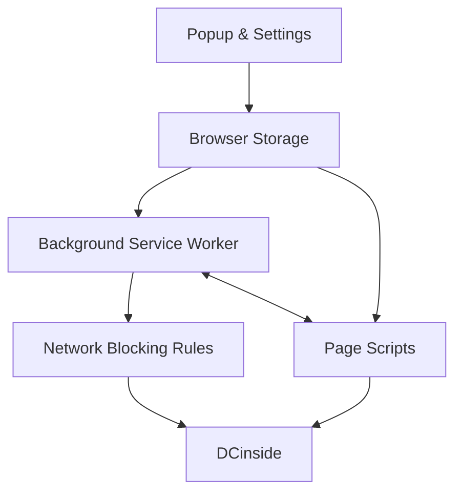

<div align="center">


# DCinside Gallery Blocker

**Less noise. More focus.**

A Chrome extension that gives you more control over what you see on DCinside.

Block unwanted galleries, posts, comments, users, keywords, images, and other distractions — without sending your browsing data to an external server.

[한국어](README.ko.md)

<p>
  <a href="https://chromewebstore.google.com/detail/fnfmdbldnhadkadklplhcjcojjiaopgg">
    
  </a>
  <a href="https://chromewebstore.google.com/detail/fnfmdbldnhadkadklplhcjcojjiaopgg">
    
  </a>
</p>

**[Install from the Chrome Web Store](https://chromewebstore.google.com/detail/fnfmdbldnhadkadklplhcjcojjiaopgg)**

</div>

---

## Why I Built It

DCinside moves fast.

Popular posts spread across galleries, comments fill up quickly, and links to unwanted content can appear in search results, sidebars, recent-history lists, and other parts of the site.

I originally built this extension for a simple reason: I wanted to decide for myself what I saw while browsing.

A basic gallery blacklist worked at first, but it did not solve the whole problem. Blocking one page did not stop links, comments, users, images, or newly loaded content from appearing elsewhere.

That small personal tool gradually became a broader content-control extension.

The goal has stayed the same:

> **Let users choose what deserves their attention.**

---

## What You Can Do

### Block galleries

Add a gallery by its ID or URL and choose how strictly it should be blocked.

* **Smart Block** — shows a warning first and still lets you enter when you intentionally want to.
* **Redirect Block** — shows a warning, then sends you back after a short delay.
* **Hard Block** — stops the gallery from loading at the browser level.

Links leading to blocked galleries can also be hidden elsewhere on DCinside.

### Clean up posts and comments

You can hide content based on:

* keywords
* user IDs
* IP addresses
* nicknames
* anonymous users
* images
* DCCons
* comments
* notices
* surveys
* selected automated content

### Control Real-Time Best

**Real-Time Best** is DCinside's feed for popular and trending posts, where users can browse active discussions and join the comments.

The extension lets you control whether blocked galleries or unwanted content appear there as well.

### Add your own browsing tools

The extension also includes:

* private notes for users
* post previews from list pages
* automatic list refresh
* compact list view
* font and text-size controls
* page-section controls
* appearance settings
* JSON backup and restore

---

## How the Project Grew

The project did not begin as a large extension.

It grew one problem at a time.

```text
Gallery blocking
        ↓
Post and comment controls
        ↓
User and keyword blocking
        ↓
Image and DCCon blocking
        ↓
User notes and post previews
        ↓
Better local data storage
        ↓
Browser-level blocking
        ↓
UI and appearance controls
        ↓
Codebase refactoring
```

Each new feature exposed a new engineering problem.

What started as a simple page blocker eventually had to deal with dynamic pages, browser storage, network rules, multiple Chrome extension contexts, performance, and long-term maintainability.

---

## How It Works

A Chrome extension does not run as one single program.

Different parts handle different jobs:



In practical terms:

* **Popup and settings pages** handle user preferences.
* **Content scripts** watch DCinside pages and hide or modify unwanted content.
* **The service worker** handles browser-level jobs such as network rules, messages, and right-click actions.
* **Chrome Storage** keeps settings and personal data.
* **Declarative Net Request** handles strict network-level blocking.

The extension is built with plain JavaScript, HTML, and CSS.

There is no framework, package installation, custom backend, or build step.

---

## Engineering Challenges

### Keeping up with a page that changes after loading

DCinside pages do not stay still after the first load.

Comments, posts, images, and other elements can be added or changed while the user is already on the page.

Scanning the entire page over and over would waste browser resources.

Instead, the extension combines:

* `MutationObserver`
* targeted DOM checks
* `requestAnimationFrame`
* short debounce windows
* scripts that can start at `document_start`

This lets the extension react to new content without repeatedly rebuilding or rescanning the whole page.

---

### Blocking the same content in different places

Blocking a gallery page alone is not enough.

A blocked gallery can still appear through:

* direct links
* search results
* recent-gallery lists
* sidebars
* Real-Time Best
* other dynamically generated links

The extension therefore handles blocking at more than one level.

```text
Network request
      ↓
Page navigation
      ↓
Links and page content
      ↓
New content added later
```

This also makes it possible to offer different blocking modes instead of forcing every user into the strictest option.

---

### Managing growing local data

Some settings are tiny. Others can grow substantially over time.

The extension uses `chrome.storage.sync` for smaller preferences and `chrome.storage.local` for larger or device-specific data.

User-block records are normalized and split across multiple storage buckets instead of being kept in one continuously growing list.

Blocked images use fingerprints so the extension can recognize the same image even when its URL changes.

---

### Keeping extension components separated

Chrome extensions run code in several separate environments.

The popup cannot simply call functions inside a DCinside page, and page scripts cannot directly do everything the background service worker can do.

The extension therefore uses explicit message passing between its components.

```text
Popup / Settings
        ↕
Background Service Worker
        ↕
Content Scripts
```

This became increasingly important as the project grew.

---

## Refactoring

The extension grew feature by feature, and the original flat file structure eventually became difficult to maintain.

The current refactoring separates code by responsibility:

```text
src/
├── background/
├── content/
│   ├── gallery/
│   ├── user/
│   ├── keyword/
│   ├── image/
│   ├── dccon/
│   ├── cleaner/
│   └── appearance/
├── shared/
└── ui/
```

The goal is not simply to make the repository look cleaner.

The goal is to make future features easier to add without forcing unrelated parts of the extension to change at the same time.

---

## Privacy

DCinside Gallery Blocker does not require an account or a developer-operated server.

The project does not include:

* analytics SDKs
* tracking pixels
* a developer-run user database
* a separate account system

Most settings and personal data stay inside the browser.

Small preferences may be synchronized through Chrome's built-in sync system. Larger personal data, such as user blocks, notes, image records, and caches, stays in local extension storage.

Some features request information directly from approved DCinside services when needed.

---

## Tech Stack

| Area                  | Technology                |
| --------------------- | ------------------------- |
| Language              | JavaScript                |
| Interface             | HTML, CSS                 |
| Platform              | Chrome Extension          |
| Extension model       | Manifest V3               |
| Local data            | Chrome Storage API        |
| Network blocking      | Declarative Net Request   |
| Background tasks      | Service Worker            |
| Dynamic page handling | MutationObserver          |
| Browser integration   | Context Menus, Active Tab |
| Distribution          | Chrome Web Store          |

---

## Install

### Chrome Web Store

**[Install DCinside Gallery Blocker](https://chromewebstore.google.com/detail/fnfmdbldnhadkadklplhcjcojjiaopgg)**

1. Click **Add to Chrome**.
2. Open the extension from the Chrome toolbar.
3. Add the galleries or content you want to block.
4. Choose the blocking mode that fits how you browse.

**Smart Block** is a good starting point if you want fewer distractions without completely locking yourself out of a gallery.

---

## Run It Locally

Clone the repository:

```bash
git clone https://github.com/diligencefrozen/DCinside-Gallery-Blocker.git
```

Then:

1. Open `chrome://extensions`.
2. Turn on **Developer mode**.
3. Click **Load unpacked**.
4. Select the project folder containing `manifest.json`.

No dependency installation or build step is required.

---

## What This Project Taught Me

Maintaining a browser extension used beyond my own machine changed the way I approached the project.

Adding a feature was no longer enough. I also had to think about:

* how features interact
* how browser contexts communicate
* how much work happens on every page update
* how user data grows over time
* how changes affect existing users
* how the codebase can remain understandable as it grows

That shift — from making a tool work to making it maintainable — has been one of the most valuable parts of the project.

---

<div align="center">

**Clean up DCinside. Keep what matters.**

[Chrome Web Store](https://chromewebstore.google.com/detail/fnfmdbldnhadkadklplhcjcojjiaopgg) · [한국어](README.ko.md)

</div>
